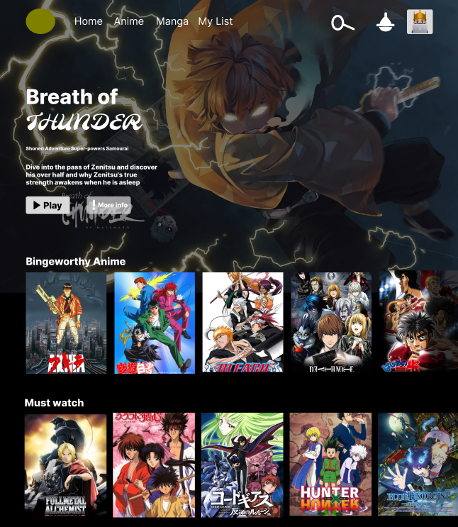

# Aniflix

## Built with MERN Stack

- <b>MongoDB</b>: A document-based database or NoSQL, to be precise MSQL.
- <b>ExpressJS</b>: A web app framework for Node.js
- <b>React</b>: A Javascript front-end library for building User Interface (UI).
- <b>Node.js</b>: Javascript run-tume environment that executes Javascript code outside of a browser (such as a server).

- and <b>Mongoose</b>: Simple, schemabased solution to model application data.

## Prerequisites
To Run this project in your system you need to install:
- [Node.js](https://nodejs.org/en/download/)
- NPM (it comes with node.js)
- [MongoDB](https://www.mongodb.com/)
or Just do the Setup. 

## Setup
Clone or download this repository

1. `cd https://github.com/John4E656F/getflixProject`
2. `npm install` To install dependencies inside the package.JSON

🚧UNDER CUNSTRUCTION🚧
### To Run

To run node server
1. `cd https://github.com/John4E656F/getflixProject/frontend`
2. `node server.js`

To run react frontend
1. `cd https://github.com/John4E656F/getflixProject/backend`
2. `npm start`

🚧UNDER CUNSTRUCTION🚧

## Anime Netflix Clone
### Design

[Click Me to Check out the UI 👈](https://www.figma.com/file/SJwTqAdGM0fmk9kw85S3Jw/Aniflex-web-design?node-id=0%3A1)

### User Funnel

[Click Me to Check out the UX 👈](https://miro.com/app/board/uXjVOmnF7ZY=/?share_link_id=286191284988)

## Technology used:
- [Tailwinds CSS](https://tailwindcss.com/docs/installation "A utility-first CSS framework")
- [NodeJS](https://nodejs.org/en/ " JavaScript runtime built on Chrome's V8 JavaScript engine") &
[Express](https://expressjs.com/ " Express is a minimal and flexible Node.js web application framework")
- [Docker](https://docs.docker.com/ "Developing, shipping, and running applications.")
- [Cookie Session](https://www.npmjs.com/package/cookie-session "Store use session with cookie. server or client")
- [Mongodb](https://www.mongodb.com/ "Database") 
- [Mongoose](https://mongoosejs.com/ "MongoDB framework object modeling for node.js") 
- [Node Fetch](https://www.npmjs.com/package/node-fetch "Node Fetch Package")
- [React ](https://reactjs.org/docs/getting-started.html)

<h1>MADE WITH ❤️ BY </h1>

<h2>The Fantastic 4</h2>

  

<a href="https://www.youtube.com/watch?v=vTIIMJ9tUc8">Click Me</a>

<table align="center">
  <tr>
    <td align="center"><a href="https://github.com/TheNewArthur"> <b>Arthur Pluym</b></a> <a href="https://github.com/TheNewArthur" title="Code">💻</a></td>
    <td align="center"><a href="https://github.com/JaggarYussef"> <b>Jaggar Yussef</b></a> <a href="https://github.com/JaggarYussef" title="Code">💻</a> </td>
    <td align="center"><a href="https://github.com/John4E656F"> <b>John Andres</b></a> <a href="https://github.com/John4E656F3" title="Code">💻</a> </td>
    <td align="center"><a href="https://github.com/Younes-sh"> <b>Younes Sheikhlaer</b></a> <a href="https://github.com/Younes-sh" title="Code">💻</a>
  </tr>
 </table>

Do not forget to leave a star! 🤗

